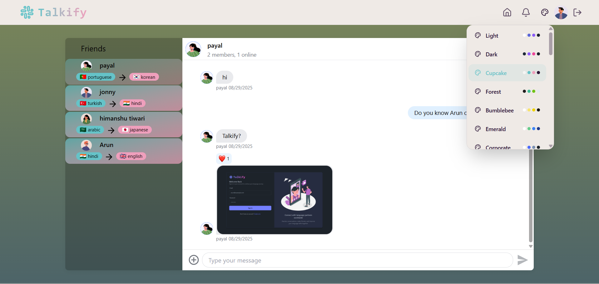
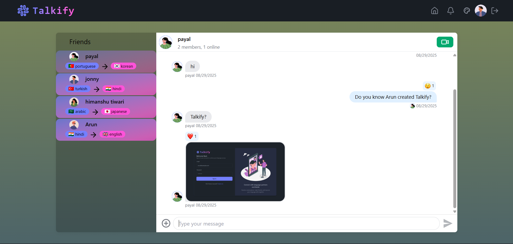

# 🌐 Talkify - Real-Time Communication Platform

A comprehensive real-time messaging and video calling platform built with modern web technologies. Talkify enables seamless communication through instant messaging, video calls, and language exchange features.

## 🚀 Features

### Core Functionality
- **🌐 Real-time Messaging** with typing indicators and message reactions
- **📹 1-on-1 and Group Video Calls** with screen sharing capabilities
- **🔐 JWT Authentication** with secure login and protected routes
- **🌍 Language Exchange Platform** connecting users globally
- **⚡ Lightning Fast Performance** with optimized state management

### User Experience
- **32 Unique UI Themes** for personalized experience
- **📱 Responsive Design** across all devices
- **🔔 Smart Notifications** for real-time updates
- **🎯 Intuitive Interface** with modern design principles

## 🛠️ Tech Stack

**Frontend:**
- React.js - Component-based UI library
- TailwindCSS - Utility-first CSS framework
- Zustand - Lightweight state management
- TanStack Query - Data fetching and caching
- React Router - Client-side routing

**Backend:**
- Express.js - Node.js web framework
- MongoDB - NoSQL database
- JWT - JSON Web Token authentication
- Stream - Real-time messaging infrastructure

**Additional Technologies:**
- Mongoose - MongoDB object modeling
- Bcrypt - Password hashing
- CORS - Cross-origin resource sharing

## 📱 Application Screenshots

### Authentication Flow

*Secure login interface with JWT authentication*

 
*User registration with form validation*


*Initial setup *

### Main Application

*Alternative home view with theme customization*


*Main dashboard with navigation and user status*


### Notifications System

*Real-time notification center with activity feed*


*Detailed notification view with interaction options*

### Chat Features

*Real-time messaging with typing indicators and reactions*


*Group chat functionality with multimedia support*

### Video Communication

*Video calling with screen sharing and recording capabilities*

## ⚙️ Installation & Setup

1. **Clone the repository**
   ```bash
   git clone https://github.com/Arun-Tomar13/Talkify.git
   cd Talkify
   ```

2. **Backend Setup**
   ```bash
   cd backend
   npm install
   ```
   
   Create `.env` file in backend directory:
   ```env
   MONGODB_URI=your_mongodb_connection_string
   JWT_SECRET=your_jwt_secret_key
   STREAM_API_KEY=your_stream_api_key
   STREAM_API_SECRET=your_stream_secret
   PORT=5000
   ```

3. **Frontend Setup**
   ```bash
   cd ../frontend
   npm install
   ```

4. **Start the application**
   
   **Backend (Terminal 1):**
   ```bash
   cd backend
   npm run dev
   ```
   
   **Frontend (Terminal 2):**
   ```bash
   cd frontend
   npm run dev
   ```

5. **Access the application**
   Open `http://localhost:5173` in your browser

## 🎯 Key Achievements

- **Real-time Communication** with zero-latency messaging
- **Scalable Architecture** supporting multiple concurrent users
- **Cross-platform Compatibility** with responsive design
- **Secure Authentication** with JWT token management
- **Advanced UI/UX** with 32 customizable themes
- **Data Persistence** with Redux and local storage integration

## 🔧 Core Components

### Frontend Architecture
- **Component-based Design** for reusability and maintainability
- **Global State Management** using Zustand for efficient data flow
- **Responsive Layout** with TailwindCSS utility classes
- **Route Protection** with React Router authentication guards

### Backend Services
- **RESTful API Design** with Express.js endpoints
- **Database Integration** with MongoDB for data persistence
- **Real-time Events** through Socket.io connections
- **Authentication Middleware** for secure route access

## 🌟 Future Enhancements

- [ ] Mobile application development
- [ ] Advanced file sharing capabilities
- [ ] Integration with calendar systems
- [ ] Enhanced language learning features
- [ ] AI-powered chat suggestions
- [ ] Advanced video call features

## 📄 License

This project is open source and available under the MIT License.

## 👨‍💻 Developer

**Tomar Arun Mukesh Singh**
- GitHub: [@Arun-Tomar13](https://github.com/Arun-Tomar13)
- Project Repository: [Talkify](https://github.com/Arun-Tomar13/Talkify)

---

*Built with ❤️ using modern web technologies*